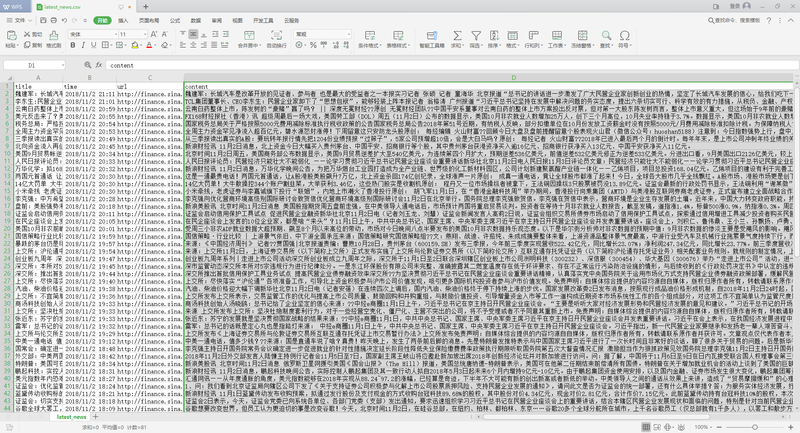
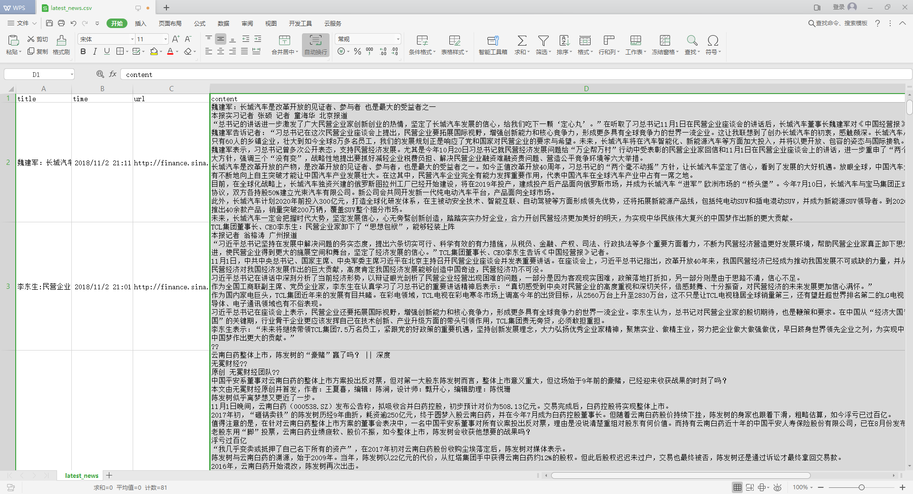

# NewsCrawler
新闻爬虫，爬取新浪、搜狐、新华网即时财经新闻。

### 新浪、搜狐、新华网财经新闻的API分别为：
```python
sina_template_url = 'http://roll.news.sina.com.cn/interface/rollnews_ch_out_interface.php?col=43&spec=&type=&ch=03&k=&offset_page=0&offset_num=0&num={}&asc=&page=1&r=0.{}'
sohu_template_url = 'http://v2.sohu.com/public-api/feed?scene=CHANNEL&sceneId=15&page=1&size={}'
xinhuanet_template_url = 'http://qc.wa.news.cn/nodeart/list?nid=11147664&pgnum={}&cnt={}&tp=1&orderby=1'
```
新浪财经新闻API(更新)抓取程序见[https://github.com/Jacen789/rolling-news](https://github.com/Jacen789/rolling-news)
```
sina_template_url = 'https://feed.mix.sina.com.cn/api/roll/get?pageid=153&lid=2516&k=&num=50&page={}&r={}'
```

### 效果如图：



